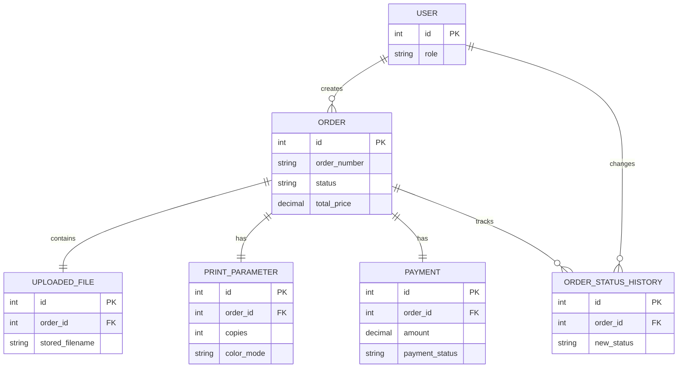

```mermaid
erDiagram
  USER ||--o{ ORDER : creates
  ORDER ||--|| UPLOADED_FILE : contains
  ORDER ||--|| PRINT_PARAMETER : has
  ORDER ||--|| PAYMENT : has
  ORDER ||--o{ ORDER_STATUS_HISTORY : tracks
  USER ||--o{ ORDER_STATUS_HISTORY : changes
  USER { int id PK string role }
  ORDER { int id PK string order_number string status decimal total_price }
  UPLOADED_FILE { int id PK int order_id FK string stored_filename }
  PRINT_PARAMETER { int id PK int order_id FK int copies string color_mode }
  PAYMENT { int id PK int order_id FK decimal amount string payment_status }
  ORDER_STATUS_HISTORY { int id PK int order_id FK string new_status }
```
